<p align="center">
  <a href="https://www.parkpick.net">
    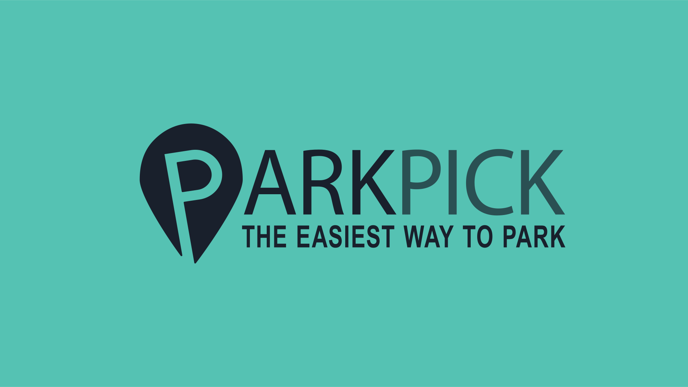
  </a>
</p>

<h2 align="center">Online Parking Payment and Reservation Software</h2>

<p align="center">
  Parkpick is an online web application that allows users to find, reserve and pay for parking spots online and ahead of time at specific parking spaces owned by clients partnered with our app. This document outlines its User Interface, its main features, and how to access the current prototype on your local network on your browser.
</p>

# ParkPick

## Table of contents

- [ParkPick](#parkpick)
  - [Table of contents](#table-of-contents)
  - [Accessing the Prototype](#accessing-the-prototype)
  - [User Guide: Main Screens and Features of ParkPick](#user-guide-main-screens-and-features-of-parkpick)
    - [Landing Page:](#landing-page)
    - [Sign Up Page:](#sign-up-page)
    - [Log In Page:](#log-in-page)
    - [Home Page:](#home-page)
    - [Card Info:](#card-info)
    - [User Profile:](#user-profile)
    - [Parking Profile:](#parking-profile)
  - [Contributors](#contributors)

## Accessing the Prototype

Step 1: Download node.js from the following link: [Node.js](https://nodejs.org/en/download/)  
Step 2: Download the project folder of ParkPick or clone the ParkPick Repository  
Step 3: Run the following command on the Parkpick project user folder:

```bash
npm install
```

Step 4: Run the following command on the Parkpick project root folder:

```bash
npm start
```

## User Guide: Main Screens and Features of ParkPick

### Landing Page:

The first page you see upon entering the application, you will be given the option to either Log In to their account, Sign Up to create a new ParkPick account, or make a one time payment to bypass the need of having an account to make a quick payment. Each button will redirect you to the Log In, Sign Up and One Time Payment pages respectively. For any inquiries a “Contact Us’ option is also available in case any issues come up. Contact Us will redirect you to our “Get In Touch” page.
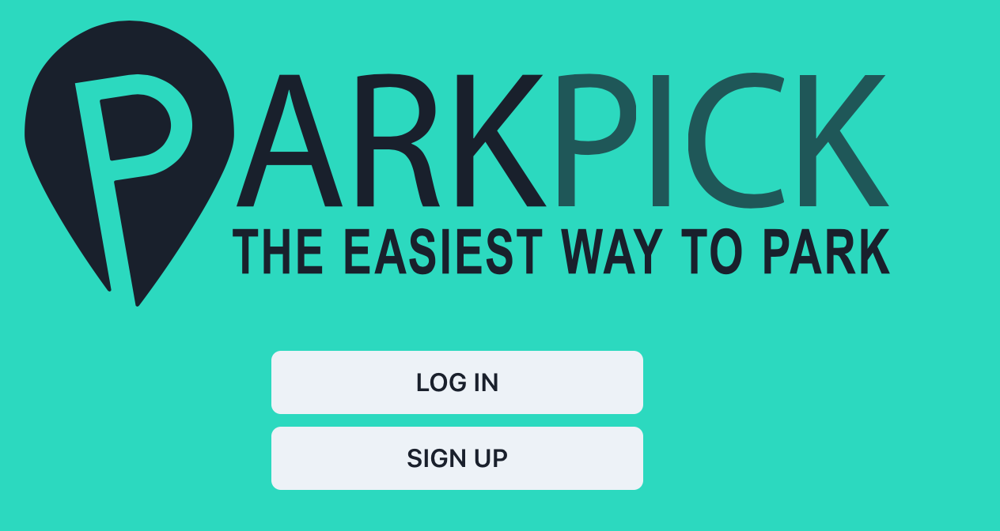

### Sign Up Page:

The information required for a new account are Full Name, Email, Phone Number and Password. For any inquiries a “Contact Us’ option is also available in case any issues come up. Contact Us will redirect you to our “Get In Touch” page.
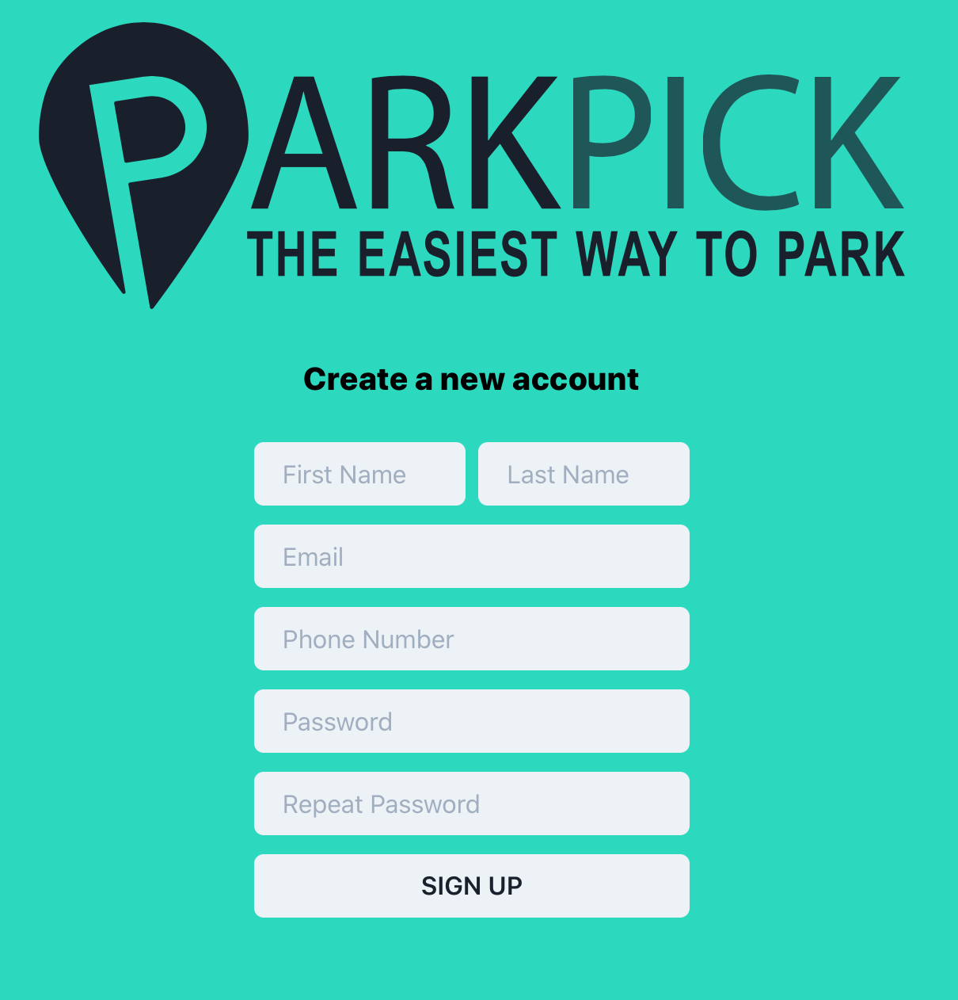

### Log In Page:

Only the email and password are required for login. In case you forgot your password then press “forgot your password?” to be redirected to a page where you’ll be asked to provide your email address for a password reset.
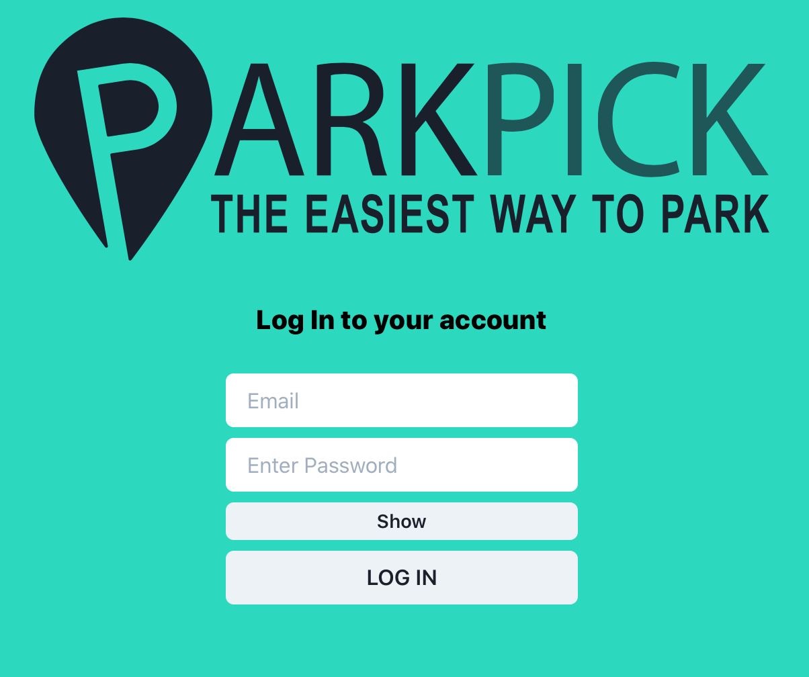

### Home Page:

To access the ParkPick Home Page, you need a ParkPick account, once you set up an account you can gain access to ParkPick’s main features through the sidebar in the homepage. On the home page you can search for a specific parking place at the top, while at the bottom it displays some recommended locations or recently visited parkings.
Graphical user interface, text, application, chat or text message.  
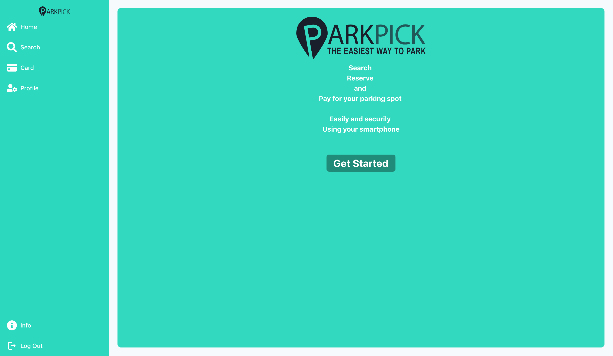


### Card Info:

Clicking the Card Icon on the sidebar will take you to the card info page, where ParkPick stores the payment methods you use.
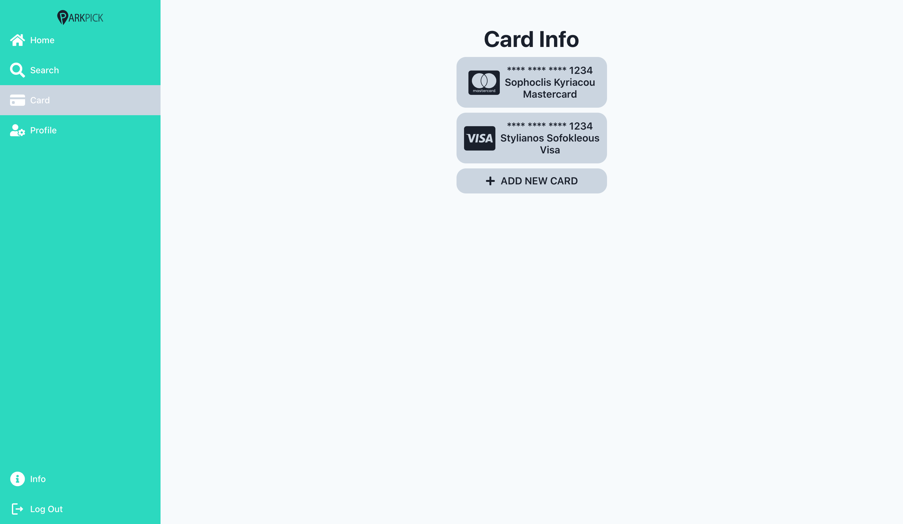
Press “Add New Card” to add a new card as a payment method for future use.  
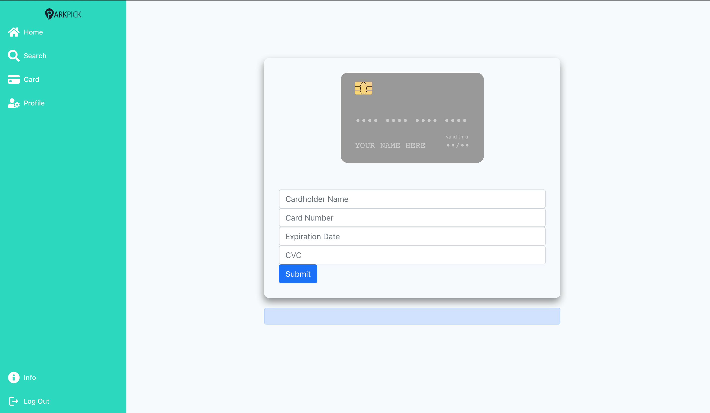

### User Profile:

Clicking the Profile Icon on the sidebar will let you view and edit your ParkPick profile, add money to your balance, and view your transaction history.
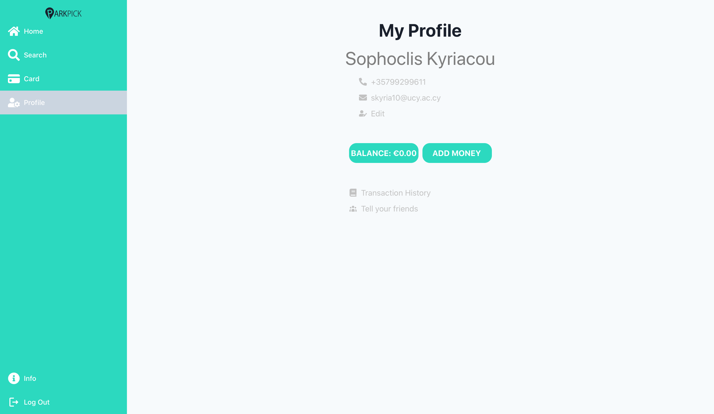

### Parking Profile:

After searching for a parking or location, you may view its profile to learn information about it such as terrain, roof, security, price, rating, address etc. After finding your desired parking and you wish to reserve and pay for a parking spot.
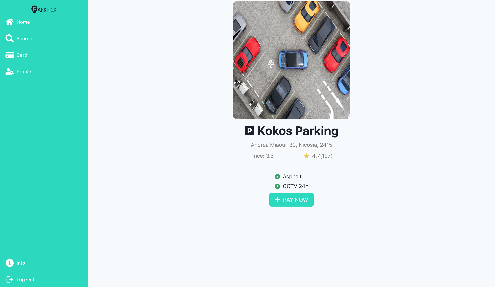  
Press pay now to be redirected to the payment screen where you will be asked to choose your preferred payment method out of the ones you have already added, or add a new one.  
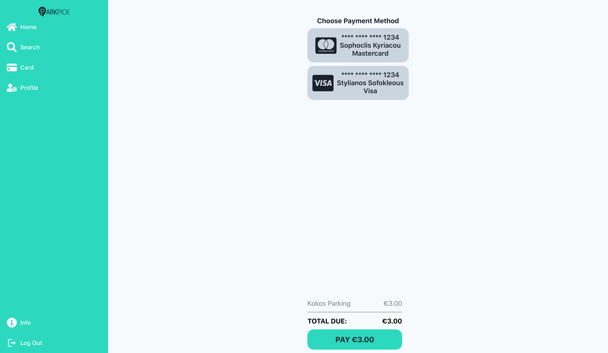
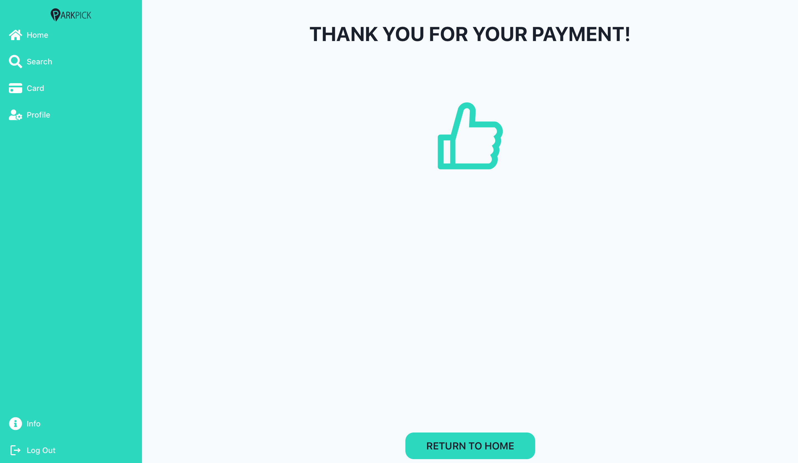

## Contributors

ParkPick was developed by:

- Stylianos Sofokleous
- Stavros Spyrou
- Sofoklis Kyriakou
- Loukas Papalazarou
- Konstantinos Larkos
- Georgios Aristodemou
